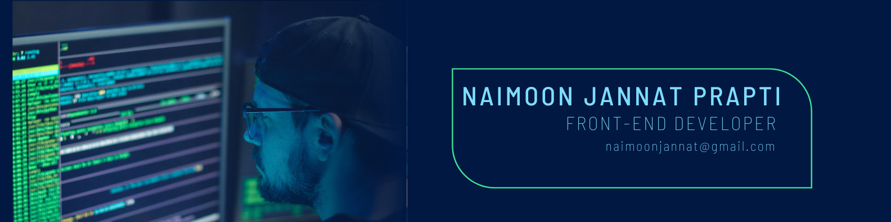

## Hi there! 
I am Naimoon Jannat Prapti, living in Bangladesh. Currently, I am pursuing a B.Sc in Computer Science and Engineering. I have a passion for web development and am dedicated to continuously learning and improving my skills in this field. In my journey, I have been exploring various web technologies and frameworks, and I enjoy building interactive and dynamic web applications. My goal is to become a proficient full-stack developer and contribute to impactful projects.

## Overview

- 🔭 I’m currently working on: A React based project
- 🌱 I’m currently learning: <b>NextJs</b>
- 💬 Ask me about: <b>HTML, CSS, JavaScript, React</b>
- 📫 How to reach me: Mail Me - <b>naimoonjannat@gmail.com</b>
- 🤔 I’m trying: <b>To improve my skills </b>
- ⚡ Fun fact: Am a BookWorm and can read for hours

## GitHub Stats

## Connect with me

## Familiar Skills

